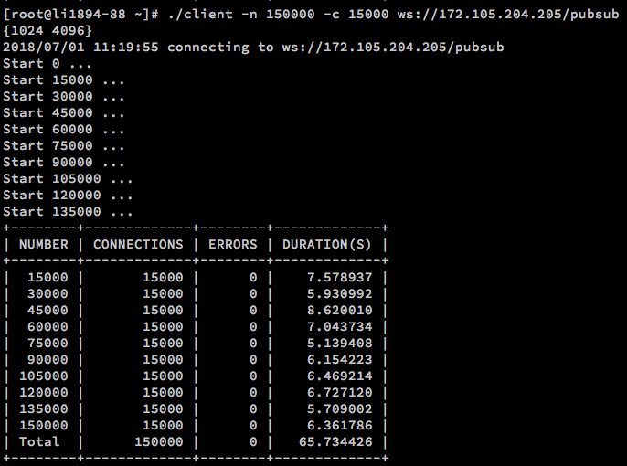

# Websocket load testing tool

<p align="center"></p>

## Install

```
go get github.com/herb123456/websocket-loading-test
```

## Usage

```
websocket-loading-test -n 150000 -c 15000 ws://172.105.204.205/pubsub
```

This command will send 150000 requests divided 10 times, and 15000 requests at the same time.

## Parameters

| Name | Description |
|------|-------------|
| n    | Total requests number |
| c    | Request at the same time |

## Result

```
+--------+-------------+--------+-------------+
| NUMBER | CONNECTIONS | ERRORS | DURATION(S) |
+--------+-------------+--------+-------------+
|  15000 |       15000 |      0 |    7.578937 |
|  30000 |       15000 |      0 |    5.930992 |
|  45000 |       15000 |      0 |    8.620010 |
|  60000 |       15000 |      0 |    7.043734 |
|  75000 |       15000 |      0 |    5.139408 |
|  90000 |       15000 |      0 |    6.154223 |
| 105000 |       15000 |      0 |    6.469214 |
| 120000 |       15000 |      0 |    6.727120 |
| 135000 |       15000 |      0 |    5.709002 |
| 150000 |       15000 |      0 |    6.361786 |
| Total  |      150000 |      0 |   65.734426 |
+--------+-------------+--------+-------------+
```